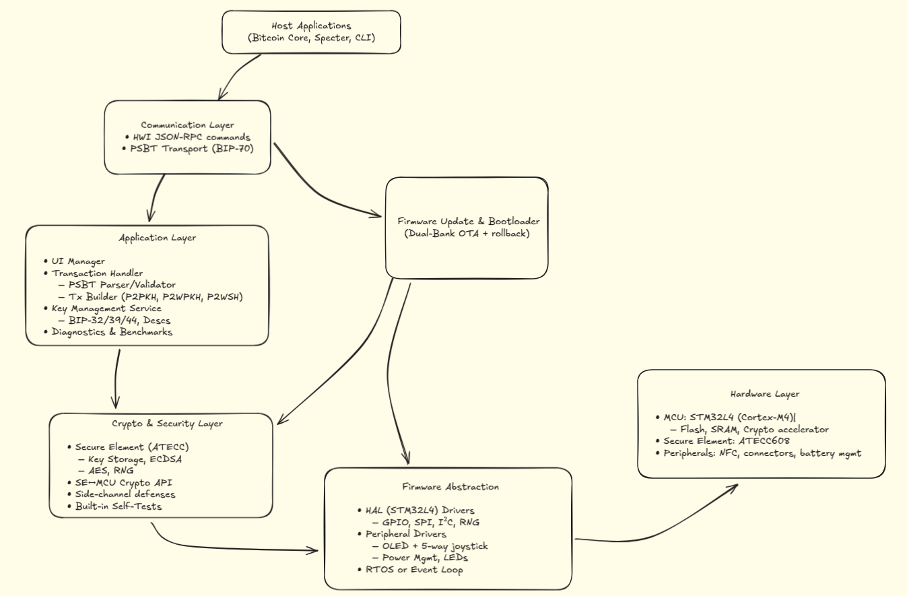

# Bitcoin-Only Firmware for Cypherock X1

## Architecture Overview

This firmware is layered for maximum security, modularity, and Bitcoin-only operation. Below is the high-level architecture:



### 1. Host Applications
- Bitcoin Core, Specter Desktop, or CLI tools interact with the device using JSON-RPC and PSBT transport (BIP-70).

### 2. Communication Layer
- Manages HWI commands and PSBT transactions between host and device.

### 3. Application Layer
- Handles the device's user interface, transaction parsing/validation, and key management (BIP-32, BIP-39, BIP-44).
- Also manages device diagnostics and benchmarking.

### 4. Crypto & Security Layer
- Secure key storage and ECDSA signing via ATECC608 secure element.
- Side-channel defenses and cryptographic RNG (random number generation).
- Built-in self-tests to validate firmware and hardware integrity.

### 5. Firmware Update & Bootloader
- Supports secure Dual-bank OTA (Over-the-Air) firmware updates with rollback in case of failure.

### 6. Firmware Abstraction
- Provides HAL (Hardware Abstraction Layer) drivers for MCU peripherals (GPIO, SPI, I2C, RNG).
- Manages display (OLED), joystick, LEDs, and battery.

### 7. Hardware Layer
- Powered by STM32L4 (Cortex-M4) microcontroller.
- Cryptographic secure element (ATECC608).
- Peripherals include NFC, connectors, and battery management modules.

---

## Features
- Bitcoin-only operation (no altcoins).
- PSBT support for secure transaction signing.
- Hardened against side-channel attacks.
- Dual-bank firmware updates with rollback.
- Secure storage of private keys and mnemonics.

## Repository Structure (Planned)
```
- crypto/
- bip39/
- bip32/
- transaction/
- comms/
- secure_element/
- host_interface/
- main.c
```

---

## Security-First Philosophy
This firmware is designed to minimize attack surfaces, use hardware-backed cryptography, and offer maximum interoperability with the Bitcoin ecosystem.

---
